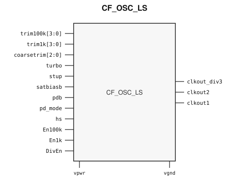

# CF_OSC_LS

> Ultra-low-power low-speed oscillator

The public GDS is an abstract; ChipFoundry
substitutes protected full geometry at tapeout.

This package ships an SRAM-style PG wrap `CF_OSC_LS` around analog leaf
`CF_OSC_LS_core`.

## Overview

`CF_OSC_LS` is a SkyWater 130 nm hard macro used as an always-on low-speed
clock for sleep counters, watchdog, and RTC-class timing. Instantiate
`CF_OSC_LS`.

Independently trimmed ~1 kHz and ~100 kHz class outputs are available, plus
a divided clock. Enable `En1k` / `En100k` / `DivEn` to select which outputs
run. `coarsetrim`, `trim1k`, and `trim100k` set the corresponding trims.
`pdb` is the power-down control.

Macro size is 189.475 × 195.335 µm (15 µm halo around analog leaf
159.475 × 165.335 µm). Customer PG for chip PDN is `vpwr` / `vgnd`. Well taps
`vpb` / `vnb` are tied inside the wrap.

## Installation

```bash
pip install cf-ipm
ipm install CF_OSC_LS --version 0.2.1
```

Use `hdl/gl/CF_OSC_LS.v` as the customer blackbox, `layout/lef/CF_OSC_LS.lef`
for P&R, and `layout/gds/CF_OSC_LS.gds` / `layout/mag/CF_OSC_LS.mag` for the
public wrap. `CF_OSC_LS_core` is the analog leaf (empty Verilog, pin-only
abstract). ChipFoundry substitutes vault GDS into `CF_OSC_LS_core` at tapeout.
P&R uses the wrap LEF (`vpwr` / `vgnd` only).

Functional sim compiles `verify/beh_model/CF_OSC_LS_core.v` **instead of** the empty `hdl/gl/CF_OSC_LS_core.v` stub. See `verify/beh_model/README.md`.

## Features

- Independently trimmed ~1 kHz (`clkout1`) and ~100 kHz (`clkout2`) class clocks
- Divided output `clkout_div3` with `DivEn`
- Output enables `En1k` / `En100k` and power-down `pdb`
- Coarse trim `coarsetrim[2:0]` plus per-output `trim1k[3:0]` / `trim100k[3:0]`
- Ideal Verilog behavioral model under `verify/beh_model/` for functional sim
- Customer cell `CF_OSC_LS` 189.475 × 195.335 µm (15 µm halo around analog leaf 159.475 × 165.335 µm)
- Chip PDN is `vpwr` / `vgnd`. Well taps `vpb` / `vnb` are tied inside the wrap.

## Pinout

Customer documentation includes a pinout of the integration cell only.
Internal schematics and architecture block diagrams are not published.



Pin names and directions match the public wrap (`layout/lef/CF_OSC_LS.lef`)
and the blackbox stub (`hdl/gl/CF_OSC_LS.v`).

## Pin Description

Directions and widths are taken from the shipped Verilog in `hdl/gl/CF_OSC_LS.v`.

| Name | Direction | Width | Description |
|---|---|---:|---|
| `trim100k` | input | 4 | Trim for the ~100 kHz class output. |
| `trim1k` | input | 4 | Trim for the ~1 kHz class output. |
| `coarsetrim` | input | 3 | Coarse oscillator trim. |
| `clkout_div3` | output | 1 | Divided clock output. |
| `clkout2` | output | 1 | ~100 kHz class clock. |
| `clkout1` | output | 1 | ~1 kHz class clock. |
| `turbo` | input | 1 | Turbo / high-drive mode. |
| `stup` | input | 1 | Start-up control. |
| `satbiasb` | input | 1 | Bias saturate (active low). |
| `pdb` | input | 1 | Power-down. |
| `pd_mode` | input | 1 | Power-down mode select. |
| `hs` | input | 1 | High-speed select. |
| `En100k` | input | 1 | Enable ~100 kHz class output. |
| `En1k` | input | 1 | Enable ~1 kHz class output. |
| `DivEn` | input | 1 | Enable divided clock output. |
| `vpwr` | input | 1 | Core supply. |
| `vgnd` | input | 1 | Ground. |

`CF_OSC_LS_core` also has well taps `vpb` / `vnb`. The wrap ties
`.vpb(vpwr)` and `.vnb(vgnd)`. Do not connect those pins at chip level.

In OpenLane / LibreLane, hook chip PDN with
`PDN_MACRO_CONNECTIONS: "u_cf_osc_ls vccd1 vssd1 vpwr vgnd"` and connect
`.vpwr(vccd1)`, `.vgnd(vssd1)` under `USE_POWER_PINS`. Do not list `vpb` /
`vnb` on the wrapper instance.

## Limitations and Open Issues

- Verilog in `hdl/gl/CF_OSC_LS.v` is a structural wrap around an empty
  `CF_OSC_LS_core` blackbox. Functional sim uses `verify/beh_model/CF_OSC_LS_core.v` (ideal model, not SPICE).
- Liberty is not in this first wrap drop. P&R uses the wrap LEF.
- Companion process-variant analog tops stay foundry-only. This package
  ships the wrap around the public analog leaf.

## Release History

| Version | Date | Notes |
|---|---|---|
| 0.2.0 | 2026-09-06 | First SRAM-style PG-wrapped package. |
| 0.2.1 | 2026-09-26 | Core fill-exclude covers so fillgen does not overwrite the analog. Ideal behavioral model for functional sim. |
